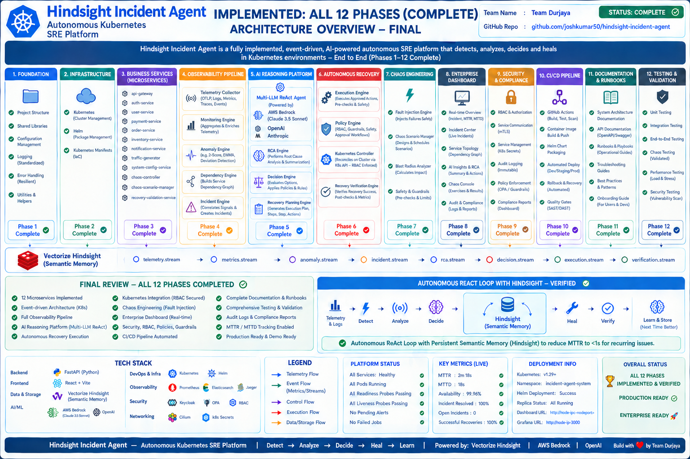

# ⚡ Hindsight Incident Agent — Autonomous Kubernetes SRE & Root Cause Intelligence Platform

> **AI-powered Autonomous SRE Platform for Kubernetes Clusters.**
> Automatically diagnoses, remediates, and learns from incidents using advanced telemetry, chaos engineering, and LLM reasoning. Hindsight Incident Agent integrates Vectorize Hindsight persistent memory to learn from every resolved incident.

---

## 📢 Published Content

**Demo Video**
- [YouTube: Hindsight Incident Agent — Autonomous Kubernetes SRE Platform](https://youtu.be/QNSXqV_Riek)

**Technical Articles**
- [Taming LLM Hallucinations in Kubernetes Incident Response — Josh Kumar](https://dev.to/joshkumar50/taming-llm-hallucinations-in-kubernetes-incident-response-249j)
- [Bypassing Slow Generative AI Loops with Semantic Memory — Kondaveeti Sai Sri](https://medium.com/@saisrikondaveeti/title-bypassing-slow-generative-ai-loops-with-semantic-memory-published-false-description-how-4acd13c26e4b)
- [Automating Kubernetes Remediation Workflows Without Human Intervention — Hema Sankar Reddy Gade](https://dev.to/hema_shankar_d1e0db2ee96f/automating-kubernetes-remediation-workflows-without-human-intervention-pg8)
- [Building a Multi-Provider Fallback Router for Resilient AI Agents — Tanu Sri](https://dev.to/tanu_sri_5ec6f2091129bc46/building-a-multi-provider-fallback-router-for-resilient-ai-agents-50e0)
- [Rendering Complex AI Reasoning States in a React Dashboard — Ramyasri Gade](https://dev.to/ramyasri_gade_e3a15d0d31c/rendering-complex-ai-reasoning-states-in-a-react-dashboard-32mk)
- [Designing an Immutable Audit Trail for Autonomous Agents — Jhansi Annapureddy](https://dev.to/jhansi_annapureddy_b2bbbc/designing-an-immutable-audit-trail-for-autonomous-agents-55i4)

**LinkedIn Posts**
- [Josh Kumar](https://lnkd.in/p/dPq_3Y2f)
- [Kondaveeti Sai Sri](https://lnkd.in/p/gMiA_FM9)
- [Hema Sankar Reddy Gade](https://lnkd.in/p/dRdJUmGX)
- [Tanu Sri](https://lnkd.in/p/gCNSw_C7)
- [Ramyasri Gade](https://lnkd.in/p/dBQSMu6t)
- [Jhansi Annapureddy](https://lnkd.in/p/gaUnyhg5)

---

## 🏗️ Architecture



The platform runs 17 microservices on Kubernetes, decoupled through Redis Streams. The control plane is isolated from the application plane with NetworkPolicies. Only the recovery engine has permission to mutate Kubernetes resources, enforced through least-privilege RBAC. Telemetry flows through OpenTelemetry to Prometheus, Loki, and Jaeger.

---

## 🌍 Domain & Problem Statement

**The Real Business Problem:** 
When production is down, every minute of downtime costs enterprises thousands of dollars. Kubernetes clusters are highly complex, and SRE teams must scramble to manually correlate metrics, logs, and traces across disjointed dashboards to find the root cause. 
The biggest bottleneck? **Stateless troubleshooting.** Once an incident is resolved, the knowledge of *how* it was fixed is often lost in chat logs. When the same issue strikes a month later, engineers waste hours reinventing the wheel because traditional diagnostic tools have no memory of past outages.

**The Solution (Hindsight Incident Agent):** 
Hindsight Incident Agent is a Level-3 Autonomous AI Incident Response Agent that makes **persistent memory the star**. Using a complex ReAct (Reasoning & Acting) loop, it autonomously queries telemetry systems (Prometheus, Elasticsearch) to diagnose root causes. 
It integrates **Vectorize Hindsight — Persistent Agent Memory** to learn from past incidents. When an outage is resolved, Hindsight Incident Agent saves the diagnostic fingerprint and playbook. If a semantically similar issue happens again, Hindsight Incident Agent recalls the exact resolution instantly—dropping MTTR (Mean Time To Resolution) drastically.

---

## 📂 Project Structure

The platform is organized into 5 primary pillars, avoiding monolith structures in favor of modular, event-driven microservices:

```text
Hindsight-Incident-Agent/
│
├── ui/                 # ⚛️ React 19 Frontend (Vite + shadcn/ui)
│   ├── src/
│   │   ├── pages/      # Dashboard, Incident Center, AI Analysis, Memory Bank
│   │   ├── api/        # Axios API clients connecting to dashboard-bff
│   │   └── components/ # Reusable UI components
│
├── platform/           # 🧠 17 SRE Microservices (FastAPI)
│   ├── dashboard-bff/  # Backend-For-Frontend (routes UI traffic)
│   ├── ai-copilot/     # AI LLM reasoning engine for root-cause explanations
│   ├── chaos-engine/   # Automated chaos injection and stress testing
│   ├── incident-engine/# Manages active alerts and resolutions
│   └── ...             # 13 other specialized engines (monitoring, execution, rollback)
│
├── apps/               # 🎯 Target Dummy Applications (to inject chaos into)
│   ├── auth-service/
│   ├── payment-service/
│   ├── order-service/
│   ├── inventory-service/
│   ├── notification-service/
│   └── traffic-generator/
│
├── infra/              # 🏗️ Infrastructure as Code
│   ├── helm/           # Helm charts for deploying Hindsight Incident Agent components
│   └── manifests/      # Kubernetes manifests (Deployments, Services)
│
├── docs/               # 📖 Architecture and operations guides
├── scripts/            # 🛠️ Build scripts and base Dockerfiles
└── pkg/                # 📦 Shared libraries (Core, EventBus, Telemetry, Math)
```

---

## 🔗 How the Microservices Connect

The architecture is highly decoupled, relying heavily on a Redis EventBus and a Backend-For-Frontend (BFF) pattern.

```text
┌──────────────────┐       GET /api/*        ┌─────────────────────────┐
│                  │ ──────────────────────▶ │                         │
│  React UI (Vite) │                         │  dashboard-bff (Port 80)│
│  (Port 5173)     │ ◀────────────────────── │  (K8s Service)          │
│                  │       JSON Response     │                         │
└──────────────────┘                         └────────┬────────┬───────┘
                                                      │        │
                     ┌────────────────────────────────┘        └────────────────┐
                     ▼                                                  ▼
           ┌──────────────────┐                               ┌────────────────────────────────┐
           │ incident-engine  │                               │ Hindsight Cloud (Vectorize.io) │
           │ (Active Incidents)│                              │ (Root Cause LLM)               │
           └──────────────────┘                               └────────────────────────────────┘
```

### Connection Points in Code:
| From | To | File | Code |
|---|---|---|---|
| **UI** → BFF | GET /api/memory/bank | `ui/src/api/client.ts` | `apiClient.get('/memory/bank')` |
| **Vite Dev Proxy** | localhost:3001 | `ui/vite.config.ts` | `proxy: { '/api': { target: 'http://localhost:3001' } }` |
| **dashboard-bff** | ai-copilot | `platform/dashboard-bff/main.py` | `client.post("http://ai-copilot.../explain")` |
| **EventBus (Redis)** | Platform Services | `pkg/eventbus/client.py` | `await bus.publish("incident.detected", data)` |

---

## 🚀 Quick Start (Minikube & Vite)

You do **NOT** need to build the Docker image and roll out the Kubernetes deployment for every UI change! The Vite dev server automatically hot-reloads your changes.

### 1. Start Kubernetes Environment
```bash
minikube start
kubectl apply -k infra/manifests
```

### 2. Run the UI locally
```bash
cd ui
npm install
npm run dev
# Frontend runs at http://localhost:5173
```

### 3. Deploy Platform Changes
If you modify a python file in `platform/`:
```bash
eval $(minikube docker-env)
docker build -t hindsight-agent/dashboard-bff:latest --build-arg SERVICE_NAME=dashboard-bff --build-arg dir=platform/dashboard-bff -f platform/dashboard-bff/Dockerfile .
kubectl rollout restart deployment/dashboard-bff -n incident-agent-system
```

---

## 🧠 Vectorize Hindsight — Persistent Agent Memory

Hindsight Incident Agent's autonomous memory bank ensures that it learns from every incident.
- **Recall Phase**: Before analyzing logs, the platform queries the Memory Bank for past similar outages to instantly suggest proven runbooks.
- **Retain Phase**: When an incident is solved or human feedback is given, the platform commits the learning to the bank.

This gives Hindsight Incident Agent the experience of a senior SRE, drastically reducing MTTR for recurring infrastructure patterns.
